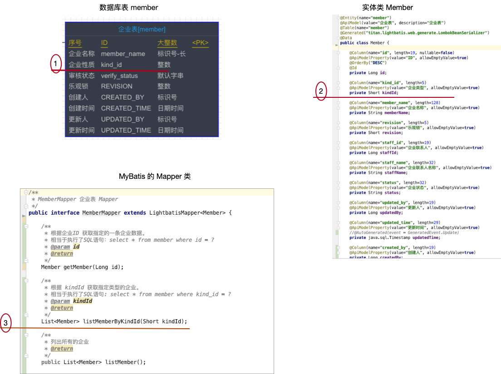

```
█████████████████████████████████████  
█████████████████████████████████████  
████ ▄▄▄▄▄ █▀█ █▄▄▀▀ ▀▄█ █ ▄▄▄▄▄ ████  
████ █   █ █▀▀▀█ ▀▀ ████▄█ █   █ ████  
████ █▄▄▄█ █▀ █▀▀▄▀▀▄ ▀█ █ █▄▄▄█ ████  
████▄▄▄▄▄▄▄█▄▀ ▀▄█▄▀▄█ ▀ █▄▄▄▄▄▄▄████  
████ ▄ ▄ ▀▄  ▄▀▄▀▄ █ █▀ █ ▀ ▀▄█▄▀████  
████▄ ▄   ▄▄██▄█▀▄  ▄▄▀█ ▄▀  ▀█▀█████  
████ ▀▄▄█ ▄▄▄ ▄█▄▄▀▄▄█▀ ▀▀▀▀▀▄▄█▀████  
█████ ▀ ▄ ▄▄█▀  ▄██ █▄▄▀  ▄ ▀▄▄▀█████  
████▀▄  ▄▀▄▄█▄▀▄▀█▄▀▀ ▄ ▀▀▀ ▀▄ █▀████  
████ ██▄▄▄▄█▀▄▀█▀█▀▄▀█ ▀▄▄█▀██▄▀█████  
████▄███▄█▄█▀▄ █▄▀▄▄▀▄██ ▄▄▄ ▀   ████  
████ ▄▄▄▄▄ █▄█▄ ▄▄  ██▄  █▄█ ▄▄▀█████  
████ █   █ █ ▀█▄ ▀ ▄▄▀▀█ ▄▄▄▄▀ ▀ ████  
████ █▄▄▄█ █ ▄▀███▀▄▄▄▄▄ █▄▀  ▄ █████  
████▄▄▄▄▄▄▄█▄███▄█▄▄▄▄▄██▄█▄▄▄▄██████  
█████████████████████████████████████  
█████████████████████████████████████ 
``` 

# lightbatis 的设计理念
    lightbatis 是基于约定的命名规范和类型规范在 Mybatis 的基础上开发的，快速的、简洁的数据层访问工具包。
## 关于命名规范
    在日常的数据库访问的操作中，我们经常遇到三个对象，分别是： 数据库表、实体类、 数据访问的 Mapper 类，以下图：  
  

    图中1处的表结构中的列名 kind_id , 第2处的实体类Member 的属性 kindId 是通过驼峰命名转化过来的，同时@Column 的注释也指定了列名
    为 kind_id, 第3处的 listMemberByKindId 方法中的参数 kindId 与 Member 类的属性 kindId 同名且同类型。由此分析他们三者之间存
    在着一系列的关联关系。我们就是把这种关联关系通过规范规定下来，形成默认的开发规则，基于这种常见的规则，便形成了统一数据访问的应用工具。
    
    通过分析我们得到以下结论：  
    **基于驼峰命名的规范通过属性、参数的名称建立表、实体类、Mapper 类的关联关系。** 以上图为例
    3处的 listMemberByKindId 方法 kindId 参数 = Member 属性 kindId = member 表 kind_id 列。
代码：
``` List<Member> listMemberByKindId(Short kindId)``` 所表达的意思就是
``` select * from member where kind_id = ? ``` 其中 kind_id = kindId, kindId 的值就是方法中 kindId 的值。基于此我们可以做  
以下的约定：  
